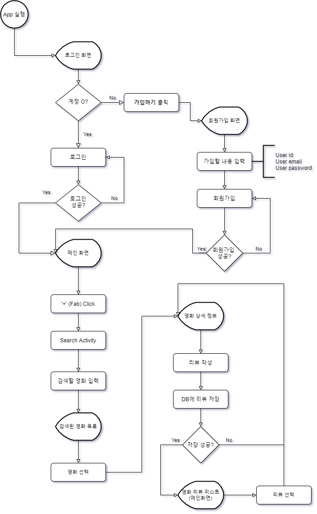
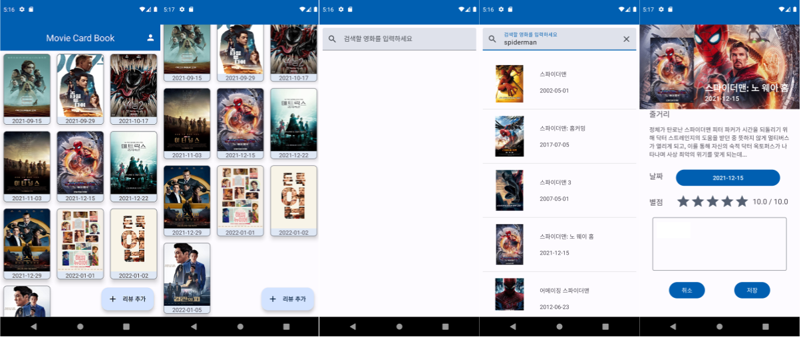

## 1. 프로젝트 소개

영화관이나 OTT 서비스틀 통해 봤던 영화들의 리뷰를 관리할 수 있는 안드로이드 애플리케이션

## 2. 프로젝트 기획

### 2-1. 문제 인식

✨ “늘어나는 OTT 서비스, 한 곳에서 모든 리뷰를 관리할 수 있는 공간의 필요성"

### 2-2. 개발 목표

- 최신 영화 정보 제공: TMDB API 이용
- 불필요한 광고 제거: 대다수의 리뷰 앱의 경운 인앱 광고 존재
- 포토 카드와 유사한 디자인 구축: 가장 무난한 디자인

### 2-3. 제목 선정 이유

Movie Card 와 Card Book 을 합쳐, Movie Card Book 으로 선정.

- Movie Card: 각각의 영화들을 포트 카드와 같은 형태로 표현
- Card Book: 명함을 보관하듯이, 메인에 여러 개의 영화를 표현

### 2-4. 유사 서비스

[Moodie](https://play.google.com/store/apps/details?id=com.memolease.android.simplelog)

- Moodie와의 차이점

  - 광고 안 보고 이용 가능
  - 가벼움 (검색 및 리뷰 기능만 존재)

## 3. 프로젝트 설계

- Flow Chart
  <!--  -->
  
- 화면 설계서

## 4. 프로젝트 개발

### 4-1. 개발 인원

문지웅 - 1인 개발

### 4-2. 개발 기간

기획부터 배포까지 총 6주 소요

### 4-3. 개발 환경

- OS: Window 11
- Framework: Android Native
- Editor&Builder: Android Studio Fox
- Theme : Material Design 3
- Test Device: Galaxy Note 10+

### 4-4. 라이브러리

- Glide / jsoup / okhttp / retrofit / json / Firebase-Firestore / Firebase-Auth

### 4-5. 핵심 코드

```kotlin
//**영화 정보 가져오는 부분**
private fun getSearchMovies() {

        binding.pbLoading.visibility = View.VISIBLE

        MoviesRepository.getSearchMovies(
            searchKeyWord,
            ::onSearchMoviesFetched,
            ::onError
        )
    }

    private fun onSearchMoviesFetched(movies: List<Movie>) {
        binding.pbLoading.visibility = View.GONE
        searchMoviesAdapter.updateMovies(movies)
    }

    private fun onError() {
        Toast.makeText(this, "search Error", Toast.LENGTH_SHORT).show()
    }
```

## 5. 프로젝트 결과

### **실행 결과**

<!--  -->


🌐[소스 코드](https://github.com/woongsnote/tmcb)

✔️[설치 링크](https://play.google.com/store/apps/details?id=com.woongsnote.mcb)

```toc

```
